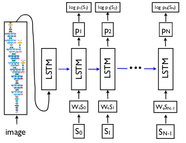
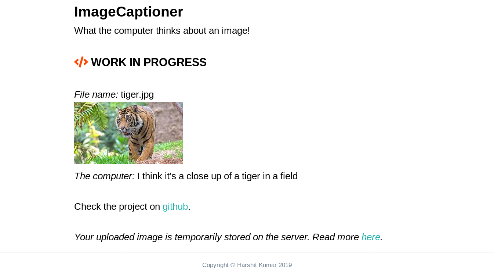

# image-captioner

Image Captioning using Encoder-Decoder

https://imagecaptioner.herokuapp.com/

`</>` **WORK IN PROGRESS**

## Overview

Recurrent Neural Networks (RNN) are used for varied number of applications including machine translation. The Encoder-Decoder architecture is utilized for such settings where a varied-length input sequence is mapped to the varied-length output sequence. The same network can also be used for image captioning.


In image captioning, the core idea is to use CNN as encoder and a normal RNN as decoder. This application uses the architecture proposed by [Show and Tell: A Neural Image Caption Generator](https://arxiv.org/abs/1411.4555).



Here's an excerpt from the paper:
> Here, we propose to follow this elegant recipe, replacing the encoder RNN by a deep convolution neural network (CNN).  Over  the  last  few  years  it  has  been  convincingly shown that CNNs can produce a rich representation of the input image by embedding it to a fixed-length vector, such that this representation can be used for a variety of vision tasks. Hence, it is natural to use a CNN as an image “encoder”, by first pre-training it for an image classification task and using the last hidden layer as an input to the RNN decoder that generates sentences. We call this model the **Neural Image Caption**, or **NIC**.

## Implementation

This image-captioner application is developed using PyTorch and Django. _All the code related to model implementation is in the [pytorch](pytorch) directory._

* **Dataset used:** MS-COCO dataset
* **Vocabulary**: The vocabulary consists of mapping between words and indices.
* **Encoder:** The ResNet101 model pretrained on Imagenet is used as encoder.
* **Decoder:** The LSTM (Long-Short Term Memory) network is used as decoder. We'll give the decoder RNN a special `<start>` token to indicate the start of the sentence and `<end>` token to indicate end of sequence. In addition to taking two weight matrices i.e. the input at the current time-step and the hidden state at the previous time-step thus combining those to get next hidden states, we need to add image information i.e. third weight matrix. Then, we sample the vocabulary at every time-step.

## Running locally

1. Cone the repo
    ```
    $ git clone https://github.com/kHarshit/image-captioner.git
    $ cd image-captioner
    ```

2. *(Optional)* Create virtual environment either through *conda* or *virtualenv*

3. Install the dependencies
    ```
    $ pip install -r requirements.txt
    ```

3. Run server
    ```
    $ python manage.py runserver
    ```
    
Your app should now be running on [localhost:8000](http://localhost:8000/).

  Input            |  Output             |
:-------------------------:|:------------------------:|
 |  |


## Image captioning with Attention

The problem with encoder-decoder approach is that all the input information needs to be compressed in a fixed length context vector. It makes it difficult for the network to cope up with large amount of input information *(e.g. in text, large sentences)* and produce good results with only that context vector. With attention mechanism, the encoder CNN instead of producing a single context vector to summarize the input image, produces a grid of vectors. In addition to sampling the vocabulary, it also produces a distribution over the locations in the image where the model looks while training thus focusing the attention at one part of image. The idea is described in [Show, Attend and Tell: Neural Image Caption Generation with Visual Attention
](https://arxiv.org/abs/1502.03044).
